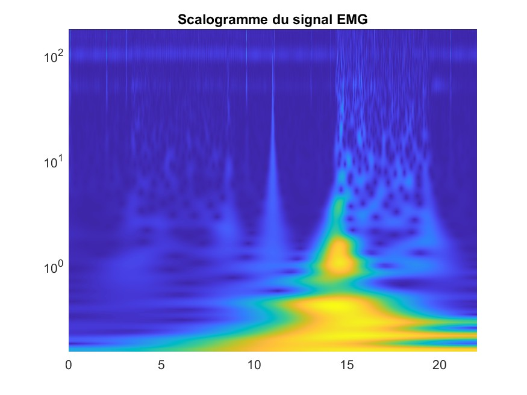
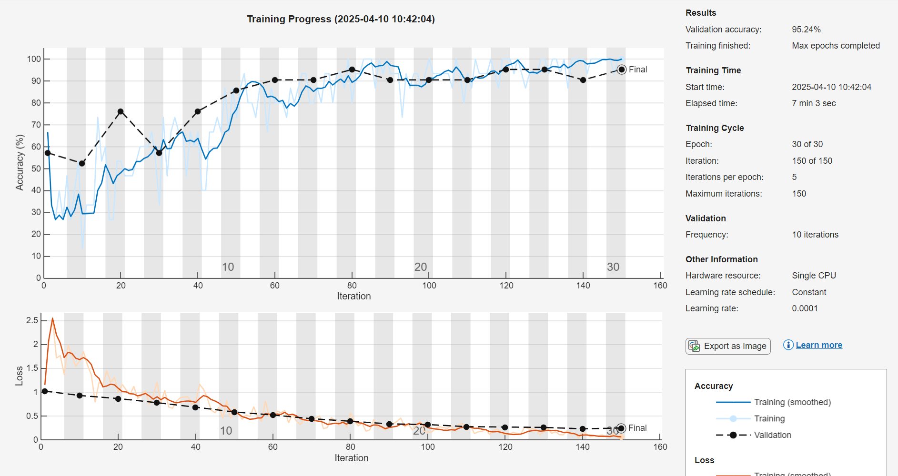
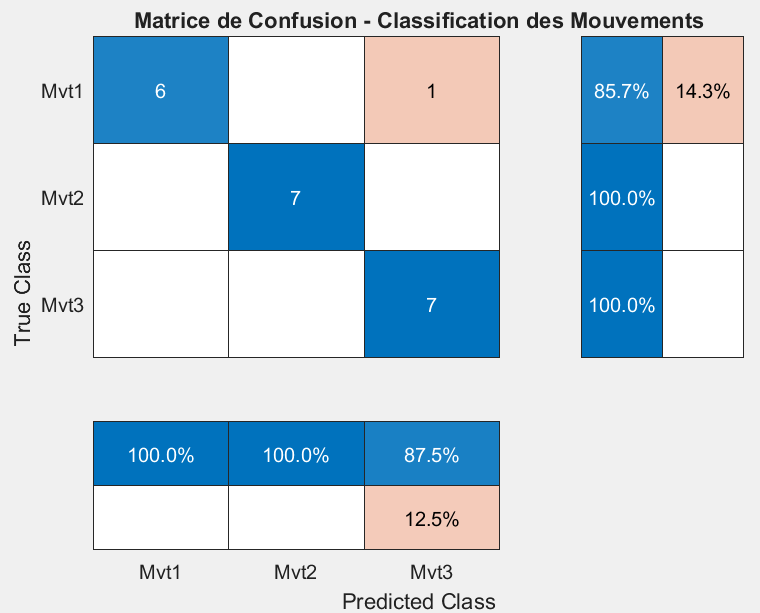

# EMG-based Prosthetic Hand Control via Transfer Learning
# 基于肌电信号与迁移学习的假肢控制系统

A Matlab/Arduino prototyping system that classifies human forearm EMG signals to control a robotic hand (Rock-Paper-Scissors game). It leverages **Continuous Wavelet Transform (CWT)** and **Transfer Learning (GoogLeNet)** to achieve **95.24% accuracy**.
本项目是一个基于 MATLAB 和 Arduino 的肌电控制原型。系统通过连续小波变换 (CWT) 将一维肌电信号转换为二维时频图，并利用迁移学习 (GoogLeNet) 识别手势意图（石头/剪刀/布），最终驱动机械手执行相应动作。

## Tech Stack & Pipeline

1.  **Hardware**: Arduino Uno, Myoware EMG Sensors x2, Servo Motors.
2.  **Signal Processing**: 
    -   **Continuous Wavelet Transform (CWT)** for feature extraction.
3.  **AI Model**: 
    -   Base Model: **GoogLeNet** (Pre-trained on ImageNet).
    -   Tech: **Transfer Learning** (Fine-tuning final fully connected layers).
    -   Classes: 3 (Rock, Paper, Scissors).
4.  **Control**: Serial communication (UART) between PC (Matlab) and MCU (Arduino).

## Project Structure

- **`arduino/`**: Firmware for EMG signal reading and Servo control.
- **`training_phase/`**: Scripts for data collection (`Mes_EMG.m`), scalogram generation (`getScalo.m`), and model training (`entrainementReseau.m`).
- **`runtime_app/`**: The main application (`Chi_Fou_Mi_Principal.m`) for real-time inference and control.

## Usage Note

1.  **Dependencies**: MATLAB with *Deep Learning Toolbox* and *Signal Processing Toolbox*.
2.  **Model**: Extract `trainedGN.mat` from `model.7z` and ensure it is in the MATLAB path.
3.  **Paths**: If you move the `.m` files, please update the file paths in the scripts accordingly.

## Results

### 1. Signal Processing (Scalogram)
Converting raw 1D EMG signals into 2D Time-Frequency Scalograms using Continuous Wavelet Transform (CWT). This image serves as the input for the neural network.
 

  

 

### 2. Training Performance
Final Validation Accuracy: 95.24%.
 

 

### 3. Confusion Matrix
Detailed classification performance on the validation set (21 samples).
- **Total Samples**: 21
- **Correct Predictions**: 20
 

  

---
*Disclaimer: This repository is for archiving and educational purposes.*